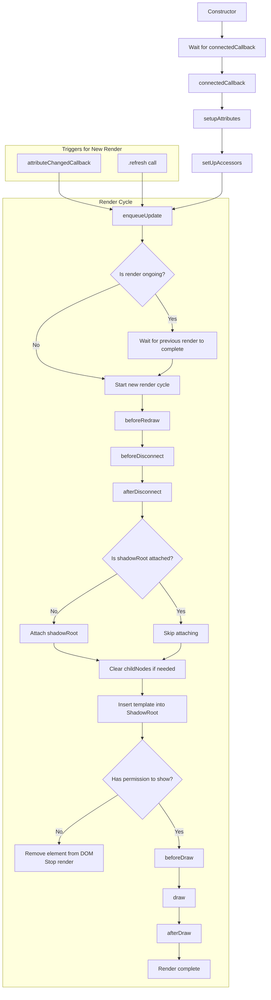

# WJElement: Comprehensive Documentation

## Overview

`WJElement` is a robust, extensible base class for custom web components. It provides a managed render lifecycle, attribute/property synchronization, permission-based visibility, and extensibility hooks. This documentation highlights the most important usage patterns, lifecycle hooks, and extension points for building reliable, maintainable components.

---

## Render Cycle

### Detailed Lifecycle Flowchart (State, Flags, and Hooks)


---

## Pinch Points & Best Practices

### 1. **Rendering and Lifecycle Hooks**
- **draw(context, store, params)**: Always override this to define your component's DOM structure. Return an HTMLElement, DocumentFragment, or HTML string.
- **beforeDraw(context, store, params) / afterDraw(context, store, params)**: Use for setup/teardown, event binding, or DOM manipulation before/after rendering.
- **beforeRedraw() / beforeDisconnect() / afterDisconnect() / componentCleanup()**: Use for cleanup, unsubscribing, or state resets when the component is redrawn or removed.

### 2. **State & Attribute Reactivity**
- **#pristine**: Internal flag to prevent unnecessary renders. Set to `false` on attribute changes or manual refresh, `true` when a render is scheduled.
- **refresh()**: Use `refresh()` to force a re-render. `enqueueUpdate()` is called automatically on attribute changes.
- **attributeChangedCallback(name, oldValue, newValue)**: Triggers a re-render when observed attributes change. This should not be overwritten only in case programmer knows what is he doing.

### 3. **Visibility & Permissions**
- **noShow**: If set, the element is removed from the DOM during render.
- **isPermissionCheck & permission**: If permission check fails, the element is removed from the DOM.

### 4. **Shadow DOM & Styling**
- **isShadowRoot / hasShadowRoot / shadowType**: Use these to enable Shadow DOM encapsulation. Set `isShadowRoot = 'open'` in `setupAttributes` for encapsulation.
- Use `setupAttributes()` to set attributes safely ( after `connectedCallback`); doing it earlier may trigger a error.
- 
- **CSSStyleSheet**: Attached after rendering for style encapsulation.

### 5. **Dependencies & Composition**
- **dependencies**: Register other custom elements/components your element depends on. Use the static `define()` method for safe registration.

### 6. **Property/Attribute Sync**
- All attributes are exposed as camelCase properties via `setUpAccessors()`. Define custom getters/setters for advanced logic.

#### `setUpAccessors()` Detailed Description

The `setUpAccessors()` method dynamically creates property accessors (getters and setters) on the component instance for each attribute present on the element. For every attribute:

- The attribute name is converted from kebab-case to camelCase (e.g., `data-id` becomes `dataId`).
- If a custom getter or setter already exists for the property, it is preserved.
- Otherwise, the generated getter returns the attribute value, and the setter updates the attribute.
- This allows you to interact with attributes as if they were native properties, enabling two-way sync between HTML attributes and JS properties.
- If you define your own getter/setter for a property, `setUpAccessors()` will not override it.

**Example:**
```js
// <my-element data-id="123" custom-flag="yes"></my-element>
element.dataId; // "123"
element.customFlag = "no"; // sets attribute custom-flag="no"
```

**Note:**  
This mechanism is especially useful for reflecting attribute changes to properties and vice versa, and for simplifying property management in custom elements.

---

## Example: Extending WJElement

```js
import WJElement from '../wje-element/element.js';

export default class Button extends WJElement {
  constructor() {
    super();
  }
  dependencies = { 'wje-icon': Icon };
  set color(value) { this.setAttribute('color', value || 'default'); }
  get color() { return this.getAttribute('color') || 'default'; }
  set round(value) { value ? this.setAttribute('round', '') : this.removeAttribute('round'); }
  get round() { return this.hasAttribute('round'); }
  setupAttributes() { this.isShadowRoot = 'open'; }
  draw() {
    const fragment = document.createDocumentFragment();
    const native = document.createElement(this.hasAttribute('href') ? 'a' : 'button');
    fragment.appendChild(native);
    return fragment;
  }
  afterDraw() { /* Bind events, handle toggles, etc. */ }
  beforeDisconnect() { /* Remove event listeners, clean up */ }
}
```

---


### HTML Attributes Used by WJElement

| Attribute                   | Type      | Description                                                                                      |
|-----------------------------|-----------|--------------------------------------------------------------------------------------------------|
| `permission`                | string    | Comma-separated list of required permissions. Used for permission-based visibility.              |
| `permission-check`          | boolean   | If present, enables permission checking for the element.                                         |
| `no-show`                   | boolean   | If present, the element will be removed from the DOM during render.                              |
| `shadow`                    | string    | If present, enables Shadow DOM. Value is the shadow root mode (`'open'` or `'closed'`).          |
| `remove-class-after-connect`| string    | Space-separated list of class names to remove after the element is connected to the DOM.         |
| (custom attributes)         | string    | Any other attribute will be exposed as a camelCase property via `setUpAccessors()`.              |

**Details:**

- `permission`: Used in conjunction with `permission-check` to determine if the element should be shown based on user permissions.
- `permission-check`: When present, triggers a check using `WjePermissionsApi.isPermissionFulfilled`.
- `no-show`: If present, the element is removed from the DOM during the display/render cycle.
- `shadow`: If present, attaches a Shadow DOM to the element. The value determines the mode (`open` by default).
- `remove-class-after-connect`: After the element is connected and rendered, the listed classes are removed from the element.
- Any other attribute: Will be accessible as a camelCase property (e.g., `data-id` becomes `dataId`) via the dynamic accessor system.

**Note:**  
All attributes are automatically synchronized with properties using the `setUpAccessors()` method, unless a custom getter/setter is defined.


## Summary Table

| Method/Property         | Purpose                                                                 |
|-------------------------|-------------------------------------------------------------------------|
| connectedCallback       | Initializes and schedules first render                                  |
| enqueueUpdate           | Schedules a render if not already rendering                            |
| refresh                 | Triggers a re-render                                                    |
| #refresh                | Handles the actual re-rendering logic                                   |
| initWjElement           | Initializes attributes, accessors, and rendering                        |
| display                 | Handles DOM rendering and permission checks                             |
| render                  | Calls draw and appends result                                           |
| setUpAccessors          | Syncs attributes and properties                                         |
| attributeChangedCallback| Handles attribute changes and schedules updates                         |
| stopRenderLoop          | Cancels pending render frames                                           |
| beforeDraw, afterDraw   | Extensibility hooks for subclasses                                      |
| beforeDisconnect, afterDisconnect, beforeRedraw | Lifecycle hooks for disconnect/redraw           |
| componentCleanup        | Cleanup logic after disconnect                                          |

---

**WJElement is designed for extensibility and robust lifecycle management in custom web components, providing a solid foundation for complex UI elements.**
